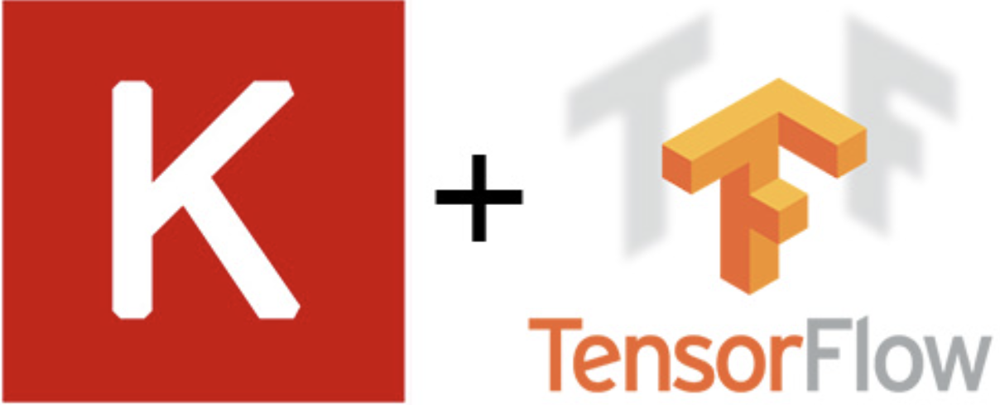

# deep-learning-challenge

A project that uses Python libraries: Pandas, SciKit-Learn, TensorFlow, and Keras Tuner to create a binary classifier using a deep learning neural network.
 
 
 

 
 
 

## Table of Contents
### Overview
### Requirements & Dependencies
### Usage
### Contributing
### License
 

### Overview  
The purpose of this project is to use a deep learning neural network to create a binary classifier that can predict, with 75% or greater accuracy, whether applicants will be successful if funded by a nonprofit organization. The dataset contains more than 34,000 entities that have received funding from the organization in the past. The dataset contains information about each entity such as the type of organization, the use of the funding, the amount of funding, and the success of the entity.

The `src` folder in this repository contains the `analysis.md` file which details the project's key features, the steps taken to complete the project, and the results. The `analysis.md` file also has a summary of the results and recommendations for next steps to optimize the binary classifier model. 
 

### Requirements & Dependencies
This project uses the following Python libraries:    

Python (version 3.10.9)

Pandas (version: 2.0.3)

TensorFlow (version: 2.15.0)

Sci-Kit Learn (version: 1.3.0)

Keras Tuner (version: 1.4.6)

     
 

### Usage
1. Ensure that you have all the necessary dependencies and files/scripts. 
    - Cloud computing resources such as Google Colab is recommended for running the code.
2. Load the project files in an appropriate code editor such as Jupyter Notebook. 
3. Run the script in the Jupyter Notebook step by step
to execute the code and visualize the results appropriately.       

### Contributions
Contributions to this project are highly encouraged! If you wish to contribute, please follow these guidelines:

- Fork the `deep-learning-challenge` repository and clone it locally.
- Create a new branch for your feature or bug fix.
- Commit your changes with descriptive commit messages.
- Push your branch to your forked repository.
- Submit a pull request to the original repository.
- Please ensure that your code adheres to the project's coding style and conventions.

If you encounter any issues or have suggestions for improvements, please open an issue on the GitHub repository.

### License
These projects are licensed under the MIT License. Feel free to use, modify, and distribute the code as per the terms of the license. 

